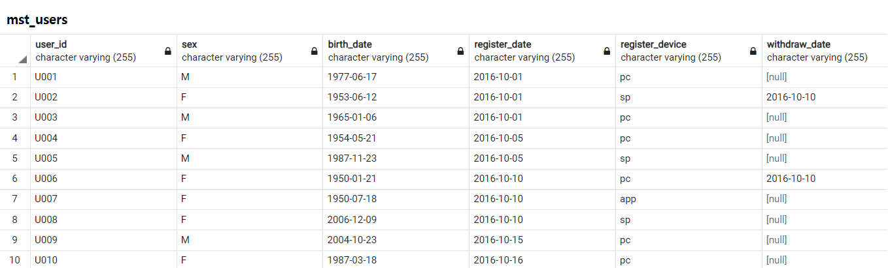
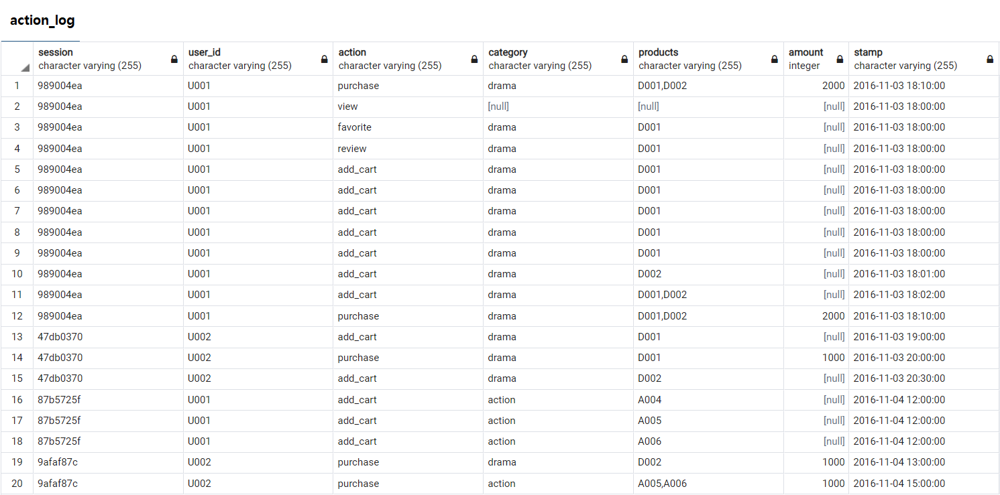

5장. 사용자를 파악하기 위한 데이터 추출
=====
11강. 사용자 전체의 특징과 경향 찾기
- - -
## 목차
1. [벤 다이어그램으로 사용자 액션 집계하기](#벤-다이어그램으로-사용자-액션-집계하기)
2. [Decile 분석을 사용해 사용자를 10단계 그룹으로 나누기](#Decile-분석을-사용해-사용자를-10단계-그룹으로-나누기)
3. [RFM 분석으로 사용자를 3가지 관점의 그룹으로 나누기](#RFM-분석으로-사용자를-3가지-관점의-그룹으로-나누기)
4. [데이터](#데이터)
5. [참고](#참고)

## 벤 다이어그램으로 사용자 액션 집계하기
```sql
WITH
user_action_flag AS (
	SELECT user_id
		 , SIGN(SUM(CASE WHEN action = 'purchase' THEN 1 ELSE 0 END)) AS has_purchase
		 , SIGN(SUM(CASE WHEN action = 'review' THEN 1 ELSE 0 END)) AS has_review
		 , SIGN(SUM(CASE WHEN action = 'favorite' THEN 1 ELSE 0 END)) AS has_favorite
	  FROM action_log
	 GROUP BY user_id
)
SELECT *
  FROM user_action_flag;


WITH
user_action_flag AS (
	SELECT user_id
		 , SIGN(SUM(CASE WHEN action = 'purchase' THEN 1 ELSE 0 END)) AS has_purchase
		 , SIGN(SUM(CASE WHEN action = 'review' THEN 1 ELSE 0 END)) AS has_review
		 , SIGN(SUM(CASE WHEN action = 'favorite' THEN 1 ELSE 0 END)) AS has_favorite
	  FROM action_log
	 GROUP BY user_id
)
, action_venn_diagram AS (
	SELECT has_purchase
		 , has_review
		 , has_favorite
		 , COUNT(1) AS users
	  FROM user_action_flag
	 GROUP BY has_purchase
			, has_review
			, has_favorite
	
	UNION ALL
	SELECT NULL AS has_purchase
		 , has_review
		 , has_favorite
		 , COUNT(1) AS users
	  FROM user_action_flag
	 GROUP BY has_review
			, has_favorite
	UNION ALL
	SELECT has_purchase
		 , NULL AS has_review
		 , has_favorite
		 , COUNT(1) AS users
	  FROM user_action_flag
	 GROUP BY has_purchase
			, has_favorite
	UNION ALL
	SELECT has_purchase
		 , has_review
		 , NULL AS has_favorite
		 , COUNT(1) AS users
	  FROM user_action_flag
	 GROUP BY has_purchase
			, has_review
	
	UNION ALL
	SELECT NULL AS has_purchase
		 , NULL AS has_review
		 , has_favorite
		 , COUNT(1) AS users
	  FROM user_action_flag
	 GROUP BY has_favorite
	UNION ALL
	SELECT NULL AS has_purchase
		 , has_review
		 , NULL AS has_favorite
		 , COUNT(1) AS users
	  FROM user_action_flag
	 GROUP BY has_review
	UNION ALL
	SELECT has_purchase
		 , NULL AS has_review
		 , NULL AS has_favorite
		 , COUNT(1) AS users
	  FROM user_action_flag
	 GROUP BY has_purchase
	
	UNION ALL
	SELECT NULL AS has_purchase
		 , NULL AS has_review
		 , NULL AS has_favorite
		 , COUNT(1) AS users
	  FROM user_action_flag
)
SELECT *
  FROM action_venn_diagram
 ORDER BY has_purchase
 		, has_review
		, has_favorite;

WITH
user_action_flag AS (
	SELECT user_id
		 , SIGN(SUM(CASE WHEN action = 'purchase' THEN 1 ELSE 0 END)) AS has_purchase
		 , SIGN(SUM(CASE WHEN action = 'review' THEN 1 ELSE 0 END)) AS has_review
		 , SIGN(SUM(CASE WHEN action = 'favorite' THEN 1 ELSE 0 END)) AS has_favorite
	  FROM action_log
	 GROUP BY user_id
)
, action_venn_diagram AS (
	SELECT has_purchase
		 , has_review
		 , has_favorite
		 , COUNT(1) AS users
	  FROM user_action_flag
	 GROUP BY CUBE(has_purchase
				 , has_review
				 , has_favorite)
)
SELECT *
  FROM action_venn_diagram
 ORDER BY has_purchase
 		, has_review
		, has_favorite;

WITH
user_action_flag AS (
	SELECT user_id
		 , SIGN(SUM(CASE WHEN action = 'purchase' THEN 1 ELSE 0 END)) AS has_purchase
		 , SIGN(SUM(CASE WHEN action = 'review' THEN 1 ELSE 0 END)) AS has_review
		 , SIGN(SUM(CASE WHEN action = 'favorite' THEN 1 ELSE 0 END)) AS has_favorite
	  FROM action_log
	 GROUP BY user_id
)
, action_venn_diagram AS (
	SELECT has_purchase
		 , has_review
		 , has_favorite
		 , COUNT(1) AS users
	  FROM user_action_flag
	 GROUP BY CUBE(has_purchase
				 , has_review
				 , has_favorite)
)
SELECT CASE has_purchase
		WHEN 1 THEN 'purchase'
		WHEN 0 THEN 'not purchase'
		ELSE 'any'
	   END AS has_purchase
	 , CASE has_review
	 	WHEN 1 THEN 'review'
		WHEN 0 THEN 'not review'
		ELSE 'any'
	   END AS  has_review
	 , CASE has_favorite
	 	WHEN 1 THEN 'favorite'
		WHEN 0 THEN 'not favorite'
		ELSE 'any'
	   END AS  has_favorite
	 , users
	 , 100.0 * users
	 	/ NULLIF(SUM(CASE WHEN has_purchase IS NULL
								AND has_review IS NULL
								AND has_favorite IS NULL
						  	THEN users
						  ELSE 0
					 END) OVER()
		  , 0) AS ratio
  FROM action_venn_diagram
 ORDER BY has_purchase
 		, has_review
		, has_favorite;
```

##### [목차로 이동](#목차)

## Decile 분석을 사용해 사용자를 10단계 그룹으로 나누기
```sql
WITH
user_purchase_amount AS (
	SELECT user_id
		 , SUM(amount) AS purchase_amount
	  FROM action_log
	 WHERE action = 'purchase'
	 GROUP BY user_id
)
, users_with_decile AS (
	SELECT user_id
		 , purchase_amount
		 , ntile(10) OVER (ORDER BY purchase_amount DESC) AS decile
	  FROM user_purchase_amount
)
SELECT *
  FROM users_with_decile;

WITH
user_purchase_amount AS (
	SELECT user_id
		 , SUM(amount) AS purchase_amount
	  FROM action_log
	 WHERE action = 'purchase'
	 GROUP BY user_id
)
, users_with_decile AS (
	SELECT user_id
		 , purchase_amount
		 , ntile(10) OVER (ORDER BY purchase_amount DESC) AS decile
	  FROM user_purchase_amount
)
, decile_with_purchase_amount AS (
	SELECT decile
		 , SUM(purchase_amount) AS amount
		 , AVG(purchase_amount) AS avg_amount
		 , SUM(SUM(purchase_amount)) OVER (ORDER BY decile) AS cumulative_amount
		 , SUM(SUM(purchase_amount)) OVER() AS total_amount
	  FROM users_with_decile
	 GROUP BY decile
)
SELECT *
  FROM decile_with_purchase_amount;

WITH
user_purchase_amount AS (
	SELECT user_id
		 , SUM(amount) AS purchase_amount
	  FROM action_log
	 WHERE action = 'purchase'
	 GROUP BY user_id
)
, users_with_decile AS (
	SELECT user_id
		 , purchase_amount
		 , ntile(10) OVER (ORDER BY purchase_amount DESC) AS decile
	  FROM user_purchase_amount
)
, decile_with_purchase_amount AS (
	SELECT decile
		 , SUM(purchase_amount) AS amount
		 , AVG(purchase_amount) AS avg_amount
		 , SUM(SUM(purchase_amount)) OVER (ORDER BY decile) AS cumulative_amount
		 , SUM(SUM(purchase_amount)) OVER() AS total_amount
	  FROM users_with_decile
	 GROUP BY decile
)
SELECT decile
	 , amount
	 , avg_amount
	 , 100.0 * amount
	 	/ total_amount AS total_ratio
	 , 100.0 * cumulative_amount
	 	/ total_amount AS cumulative_ratio
  FROM decile_with_purchase_amount;
```


##### [목차로 이동](#목차)

## RFM 분석으로 사용자를 3가지 관점의 그룹으로 나누기
```sql
WITH
purchase_log AS (
	SELECT user_id
		 , amount
		 , substring(stamp, 1, 10) AS dt
	  FROM action_log
	 WHERE action = 'purchase'
)
, user_rfm AS (
	SELECT user_id
		 , MAX(dt) AS recent_date
		 , CURRENT_DATE - MAX(dt::date) AS recency
		 , COUNT(dt) AS frequency
		 , SUM(amount) AS monetary
	  FROM purchase_log
	 GROUP BY user_id
)
SELECT *
  FROM user_rfm;

WITH
purchase_log AS (
	SELECT user_id
		 , amount
		 , substring(stamp, 1, 10) AS dt
	  FROM action_log
	 WHERE action = 'purchase'
)
, user_rfm AS (
	SELECT user_id
		 , MAX(dt) AS recent_date
		 , CURRENT_DATE - MAX(dt::date) AS recency
		 , COUNT(dt) AS frequency
		 , SUM(amount) AS monetary
	  FROM purchase_log
	 GROUP BY user_id
)
, user_rfm_rank AS (
	SELECT user_id
		 , recent_date
		 , recency
		 , frequency
		 , monetary
		 , CASE
			WHEN recency < 14 THEN 5
			WHEN recency < 28 THEN 4
			WHEN recency < 60 THEN 3
			WHEN recency < 90 THEN 2
			ELSE 1
		   END AS r
		 , CASE
			WHEN 20 <= frequency THEN 5
			WHEN 10 <= frequency THEN 4
			WHEN 5 <= frequency THEN 3
			WHEN 2 <= frequency THEN 2
			WHEN 1 <= frequency THEN 1
		   END AS f
		 , CASE
			WHEN 300000 <= monetary THEN 5
			WHEN 100000 <= monetary THEN 4
			WHEN 30000 <= monetary THEN 3
			WHEN 5000 <= monetary THEN 2
			ELSE 1
		   END AS m
	  FROM user_rfm
)
SELECT *
  FROM user_rfm_rank;

WITH
purchase_log AS (
	SELECT user_id
		 , amount
		 , substring(stamp, 1, 10) AS dt
	  FROM action_log
	 WHERE action = 'purchase'
)
, user_rfm AS (
	SELECT user_id
		 , MAX(dt) AS recent_date
		 , CURRENT_DATE - MAX(dt::date) AS recency
		 , COUNT(dt) AS frequency
		 , SUM(amount) AS monetary
	  FROM purchase_log
	 GROUP BY user_id
)
, user_rfm_rank AS (
	SELECT user_id
		 , recent_date
		 , recency
		 , frequency
		 , monetary
		 , CASE
			WHEN recency < 14 THEN 5
			WHEN recency < 28 THEN 4
			WHEN recency < 60 THEN 3
			WHEN recency < 90 THEN 2
			ELSE 1
		   END AS r
		 , CASE
			WHEN 20 <= frequency THEN 5
			WHEN 10 <= frequency THEN 4
			WHEN 5 <= frequency THEN 3
			WHEN 2 <= frequency THEN 2
			WHEN 1 <= frequency THEN 1
		   END AS f
		 , CASE
			WHEN 300000 <= monetary THEN 5
			WHEN 100000 <= monetary THEN 4
			WHEN 30000 <= monetary THEN 3
			WHEN 5000 <= monetary THEN 2
			ELSE 1
		   END AS m
	  FROM user_rfm
)
, mst_rfm_index AS (
	SELECT 1 AS rfm_index
	UNION ALL
	SELECT 2 AS rfm_index
	UNION ALL
	SELECT 3 AS rfm_index
	UNION ALL
	SELECT 4 AS rfm_index
	UNION ALL
	SELECT 5 AS rfm_index
)
, rfm_flag AS (
	SELECT m.rfm_index
		 , CASE
			WHEN m.rfm_index = r.r THEN 0
			ELSE 0
		   END AS r_flag
		 , CASE
			WHEN m.rfm_index = r.f THEN 0
			ELSE 0
		   END AS f_flag
		 , CASE
			WHEN m.rfm_index = r.m THEN 0
			ELSE 0
		   END AS m_flag
	  FROM mst_rfm_index AS m
	 CROSS JOIN user_rfm_rank AS r
)
SELECT rfm_index
	 , SUM(r_flag) AS r
	 , SUM(f_flag) AS f
	 , SUM(m_flag) AS m
  FROM rfm_flag
 GROUP BY rfm_index
 ORDER BY rfm_index DESC;
```


##### [목차로 이동](#목차)

## 데이터
</br>

</br>

```sql
DROP TABLE IF EXISTS mst_users;
CREATE TABLE mst_users(
    user_id         varchar(255)
  , sex             varchar(255)
  , birth_date      varchar(255)
  , register_date   varchar(255)
  , register_device varchar(255)
  , withdraw_date   varchar(255)
);

INSERT INTO mst_users
VALUES
    ('U001', 'M', '1977-06-17', '2016-10-01', 'pc' , NULL        )
  , ('U002', 'F', '1953-06-12', '2016-10-01', 'sp' , '2016-10-10')
  , ('U003', 'M', '1965-01-06', '2016-10-01', 'pc' , NULL        )
  , ('U004', 'F', '1954-05-21', '2016-10-05', 'pc' , NULL        )
  , ('U005', 'M', '1987-11-23', '2016-10-05', 'sp' , NULL        )
  , ('U006', 'F', '1950-01-21', '2016-10-10', 'pc' , '2016-10-10')
  , ('U007', 'F', '1950-07-18', '2016-10-10', 'app', NULL        )
  , ('U008', 'F', '2006-12-09', '2016-10-10', 'sp' , NULL        )
  , ('U009', 'M', '2004-10-23', '2016-10-15', 'pc' , NULL        )
  , ('U010', 'F', '1987-03-18', '2016-10-16', 'pc' , NULL        )
;

DROP TABLE IF EXISTS action_log;
CREATE TABLE action_log(
    session  varchar(255)
  , user_id  varchar(255)
  , action   varchar(255)
  , category varchar(255)
  , products varchar(255)
  , amount   integer
  , stamp    varchar(255)
);

INSERT INTO action_log
VALUES
    ('989004ea', 'U001', 'purchase', 'drama' , 'D001,D002', 2000, '2016-11-03 18:10:00')
  , ('989004ea', 'U001', 'view'    , NULL    , NULL       , NULL, '2016-11-03 18:00:00')
  , ('989004ea', 'U001', 'favorite', 'drama' , 'D001'     , NULL, '2016-11-03 18:00:00')
  , ('989004ea', 'U001', 'review'  , 'drama' , 'D001'     , NULL, '2016-11-03 18:00:00')
  , ('989004ea', 'U001', 'add_cart', 'drama' , 'D001'     , NULL, '2016-11-03 18:00:00')
  , ('989004ea', 'U001', 'add_cart', 'drama' , 'D001'     , NULL, '2016-11-03 18:00:00')
  , ('989004ea', 'U001', 'add_cart', 'drama' , 'D001'     , NULL, '2016-11-03 18:00:00')
  , ('989004ea', 'U001', 'add_cart', 'drama' , 'D001'     , NULL, '2016-11-03 18:00:00')
  , ('989004ea', 'U001', 'add_cart', 'drama' , 'D001'     , NULL, '2016-11-03 18:00:00')
  , ('989004ea', 'U001', 'add_cart', 'drama' , 'D002'     , NULL, '2016-11-03 18:01:00')
  , ('989004ea', 'U001', 'add_cart', 'drama' , 'D001,D002', NULL, '2016-11-03 18:02:00')
  , ('989004ea', 'U001', 'purchase', 'drama' , 'D001,D002', 2000, '2016-11-03 18:10:00')
  , ('47db0370', 'U002', 'add_cart', 'drama' , 'D001'     , NULL, '2016-11-03 19:00:00')
  , ('47db0370', 'U002', 'purchase', 'drama' , 'D001'     , 1000, '2016-11-03 20:00:00')
  , ('47db0370', 'U002', 'add_cart', 'drama' , 'D002'     , NULL, '2016-11-03 20:30:00')
  , ('87b5725f', 'U001', 'add_cart', 'action', 'A004'     , NULL, '2016-11-04 12:00:00')
  , ('87b5725f', 'U001', 'add_cart', 'action', 'A005'     , NULL, '2016-11-04 12:00:00')
  , ('87b5725f', 'U001', 'add_cart', 'action', 'A006'     , NULL, '2016-11-04 12:00:00')
  , ('9afaf87c', 'U002', 'purchase', 'drama' , 'D002'     , 1000, '2016-11-04 13:00:00')
  , ('9afaf87c', 'U002', 'purchase', 'action', 'A005,A006', 1000, '2016-11-04 15:00:00')
;
```

##### [목차로 이동](#목차)

## 참고


##### [목차로 이동](#목차)
